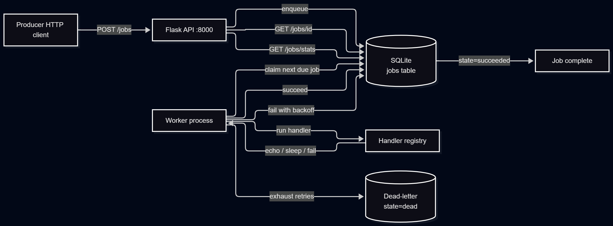

# kazi-q

A small background job queue written in Python. Producers enqueue jobs over
HTTP, workers pick them up and run them, failures are retried with
exponential backoff, and jobs that keep failing land in a dead-letter queue.

The name is a mix of Swahili and English: *kazi* means "work", and *q*
stands for queue.

## Why I built this

I wanted to understand how background job systems work under the hood. Every
production backend has some kind of queue, but the reliability primitives
(retries, backoff, dead-letter queues, idempotency) are hard to learn from
using a library like Celery. Building one from scratch makes them concrete.

## What it does

Producer side:

- `POST /jobs` enqueues a job
- `GET /jobs/{id}` fetches a job by id
- `GET /jobs/stats` returns counts by state
- `GET /jobs/dead` lists dead-letter jobs
- `GET /health` liveness check

Worker side:

- Separate process (`python -m app.worker`)
- Polls for pending jobs and claims the oldest one that's due
- Runs the handler registered for the job's type
- On success: state becomes `succeeded`
- On failure: retries with exponential backoff, up to `max_retries`
- After exhausting retries: state becomes `dead` (dead-letter)

## Architecture



The API and worker are separate processes. They communicate only through
the `jobs` table. The worker can be scaled horizontally by running more
copies; each claims different jobs.

## Job states

| State | Meaning |
|---|---|
| `pending` | Waiting to run, or waiting out a backoff window |
| `running` | Currently being executed by a worker |
| `succeeded` | Finished successfully |
| `dead` | Failed too many times, moved to dead-letter |

A job with retries remaining goes back to `pending` with a future
`next_run_at`. It's only marked `dead` when `attempts >= max_retries`.

## Retry and backoff

When a job's handler raises, the worker:

1. Increments `attempts`
2. If `attempts < max_retries`: sets `state=pending`, `next_run_at = now + base^attempts`
3. If `attempts >= max_retries`: sets `state=dead`

Default backoff is exponential with `base=2.0`, so retries happen at
2s, 4s, 8s, etc. All three settings are configurable in `.env`.

## Try the demo first

The fastest way to see the whole system work:

```bash
python -m venv .venv
source .venv/Scripts/activate    # Windows Git Bash
# or: source .venv/bin/activate  # macOS / Linux
pip install -r requirements.txt

python -m scripts.demo
```

The demo runs the API and worker in-process, enqueues three jobs (`echo`,
`sleep`, `fail`), and prints the final state. It exits in about 20 seconds.

Expected output:

```
[4/5] final stats:
      pending    0
      running    0
      succeeded  2
      dead       1
      total      3

      dead-letter jobs:
      a92299fe279b  type=fail  attempts=3
        last_error: RuntimeError: demonstration failure
```

## Running it manually

Start the API in one terminal:

```bash
python -m app.api
```

Start a worker in another:

```bash
python -m app.worker
```

Enqueue a job that will succeed:

```bash
curl -X POST http://127.0.0.1:8000/jobs \
  -H "Content-Type: application/json" \
  -d '{"type": "echo", "payload": {"message": "hello"}}'
```

Watch the worker log. Within a second you'll see the job run and succeed.

Enqueue a job that will fail every time:

```bash
curl -X POST http://127.0.0.1:8000/jobs \
  -H "Content-Type: application/json" \
  -d '{"type": "fail", "payload": {"message": "boom"}}'
```

Watch the worker retry it three times (2s, 4s backoff) and then move it to
the dead-letter queue.

Check the results:

```bash
curl http://127.0.0.1:8000/jobs/stats
curl http://127.0.0.1:8000/jobs/dead
```

## Built-in handlers

| Type | Behavior |
|---|---|
| `echo` | Logs and returns the payload. Smoke test. |
| `sleep` | Sleeps for `payload["seconds"]`. Tests slow jobs. |
| `fail` | Always raises. Tests retry and dead-letter. |

Adding a handler is one decorator:

```python
from app.handlers import register

@register("send_email")
def handle_send_email(payload):
    ...
    return {"sent": True}
```

The worker picks it up on next restart.

## Tests

```bash
pytest
```

Twenty-four tests covering the API layer, the job helpers, and the worker
including claim ordering, state transitions, retries, backoff, and
dead-letter behavior.

## Project layout

```
kazi-q/
├── app/
│   ├── api.py         Flask API
│   ├── worker.py      polling worker process
│   ├── handlers.py    handler registry
│   ├── jobs.py        enqueue / fetch / stats helpers
│   ├── models.py      SQLAlchemy Job model and JobState enum
│   ├── db.py          engine and session setup
│   └── config.py      env-based settings
├── scripts/
│   └── demo.py        end-to-end demo
├── tests/
├── docs/
│   └── architecture.png
└── requirements.txt
```

## Design notes

Two documents cover the *why* behind kazi-q:

- [`docs/DESIGN.md`](docs/DESIGN.md) — storage, atomic claiming, retry
  strategy, backoff math, process model, timezone handling, and what was
  deliberately left out.
- [`docs/FAILURES.md`](docs/FAILURES.md) — how the system behaves when
  things go wrong: worker crashes, poison jobs, backlog growth, SQLite
  write contention, and known gaps.

If you're reading this to evaluate the project, those two documents are
worth more than the code.

## License

MIT